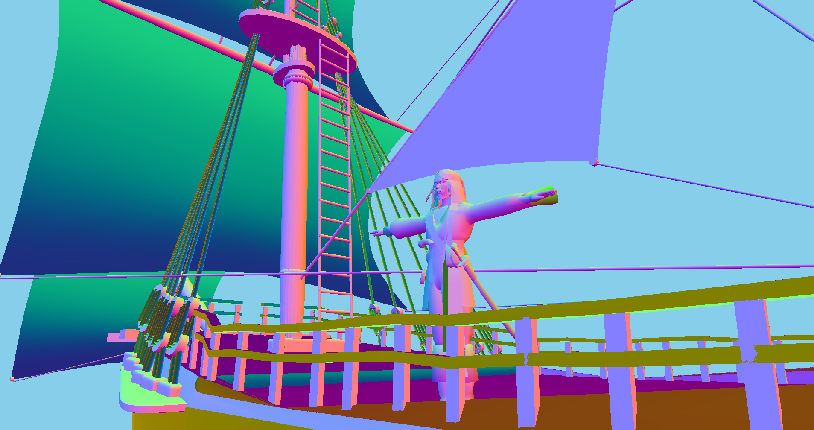

# Mini GLTF Loader (OpenGL/C++)

Loads and renders GLTF 2.0 models. The purpose was to figure out how to load GLTF models for use in future projects.

  
*Example models ([1](https://sketchfab.com/3d-models/jack-sparrow-fcd32b3e0f90419f9c594ddb461c8d60#download), [2](https://sketchfab.com/3d-models/ship-x-sail-opaque-52a37fa586df49d1aa361019e8b1e7ef)) rendered with this loader*

## Features
- Loads GLTF 2.0 models
- Textures
- Materials
- Basic PBR
